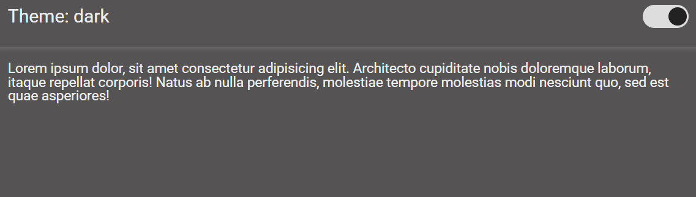

# 🌗 Theme Switcher — Light / Dark Mode

Простий приклад реалізації перемикання теми між **світлою** та **темною** версією за допомогою **CSS-змінних** та **JavaScript**.

---

  

## 🚀 Демонстрація

На сторінці є перемикач, який змінює тему сайту між `light` і `dark`.  
При зміні теми змінюються:
- кольори фону та тексту;
- тіні (`box-shadow`);
- вигляд перемикача.

---

🧩 Основні можливості

✅ Перемикання теми кліком на перемикач
✅ Плавна анімація змін кольорів і положення кнопки
✅ Повна адаптивність без зовнішніх бібліотек
✅ Використання CSS-змінних для централізованого керування стилями
